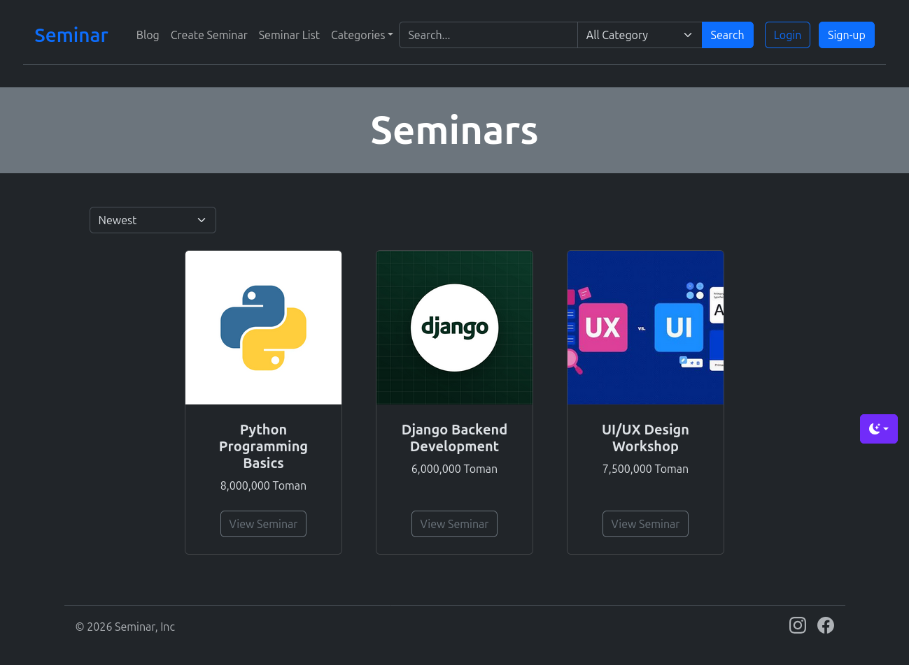
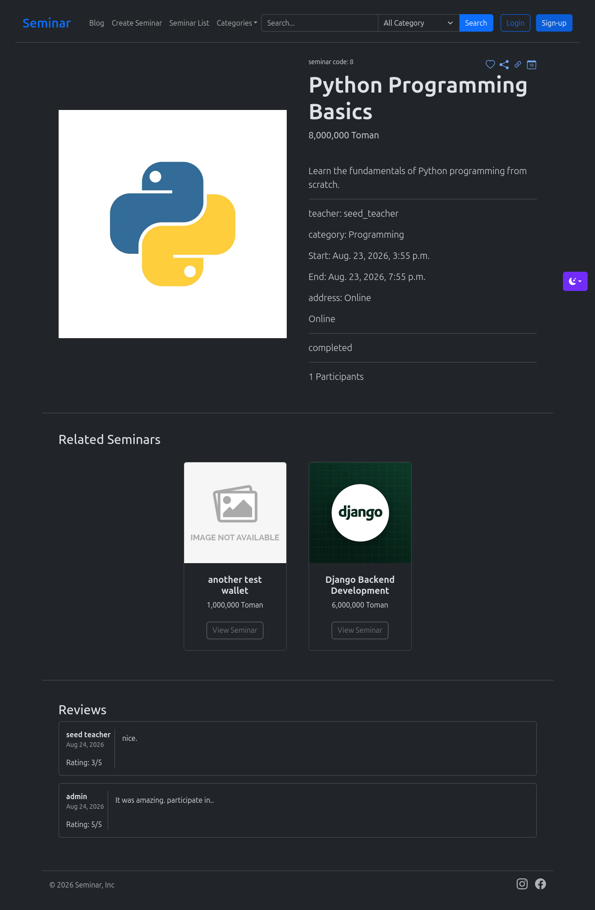
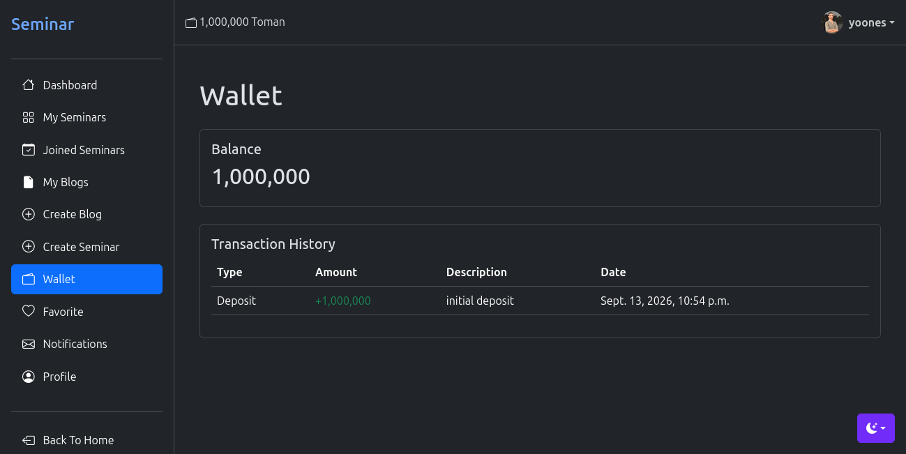
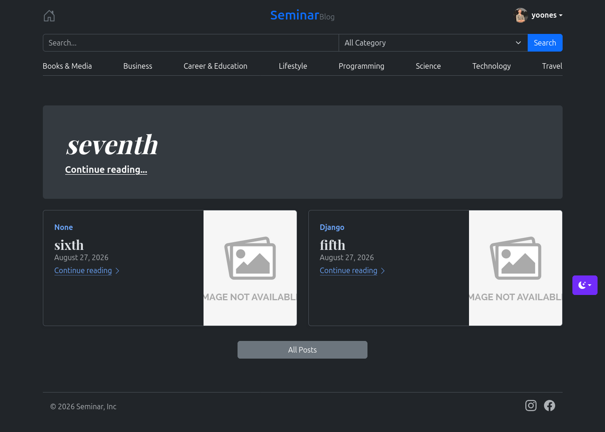

# Seminar Management System

A full-featured seminar management web application built with **Django**.

The platform allows users to discover and register for seminars, manage their profiles, save favorite seminars, leave reviews, manage their wallet balance, and receive notifications. It also includes a blog and category-based content management system.

## Screenshots

### Seminar List



### Seminar Details



### Dashboard



### Blog



## Features

### 👤 User Management

* Custom user model
* User registration and authentication
* Profile management
* Profile picture
* Phone number and email
* Birth date and location
* Address management

### 🎓 Seminar Management

* Create and manage seminars
* Seminar categories
* Seminar images
* Participant management
* Online and in-person seminars
* Session start and end times
* Seminar pricing
* Public/private seminars
* Seminar registration
* Related seminars
* Soft deletion

### 🔎 Search & Categories

* Search functionality
* Category-based filtering
* Category-aware search
* Breadcrumb navigation
* Search across relevant content

### ❤️ Favorites

* Add seminars to favorites
* Remove seminars from favorites
* View favorite seminars from the dashboard

### ⭐ Reviews

* Seminar reviews
* 1–5 star rating system
* Written comments
* Review submission through the user interface

### 💰 Wallet

* User wallet and balance
* Balance displayed in the navigation
* Wallet transactions
* Deposit and deduction transactions
* Formatted monetary values with thousands separators

### 🔔 Notifications

* User notifications
* Read/unread notification state
* Notification management
* Dashboard notification interface

### 📝 Blog

* Blog posts
* Categories and nested categories
* Draft and published posts
* Publication dates
* Automatic slug generation
* Rich-text editing with CKEditor
* Staff-only post creation
* Soft deletion
* Search and category filtering
* Breadcrumb navigation

### 🎨 User Interface

* Responsive design
* Bootstrap 5
* Bootstrap Icons
* Dark mode
* Reusable template components
* Dashboard interface
* Django messages and alerts
* Responsive forms and modals

## Tech Stack

* **Python**
* **Django 6**
* **SQLite 3**
* **Bootstrap 5**
* **django-bootstrap5**
* **django-ckeditor-5**
* **Pillow**
* **HTML5**
* **CSS3**
* **JavaScript**
* **Git / GitHub**

## Project Structure

```text
seminar/
│
├── accounts/              # User accounts and authentication
├── blog/                  # Blog posts and categories
├── core/                  # Core application functionality
├── dashboard/             # User dashboard functionality
├── seminar/               # Seminar-related functionality
│
├── seed_data/
│   └── seminar_images/    # Seed images for seminars
│
├── static/                # Static files
├── templates/             # Django templates and components
│
├── manage.py
├── requirements.txt
├── .gitignore
└── README.md
```

## Installation

### 1. Clone the repository

```bash
git clone https://github.com/yoonesrahimian/seminar.git
cd seminar
```

### 2. Create a virtual environment

```bash
python -m venv .venv
```

Activate the environment on Linux/macOS:

```bash
source .venv/bin/activate
```

On Windows:

```powershell
.venv\Scripts\activate
```

### 3. Install dependencies

```bash
pip install -r requirements.txt
```

The project dependencies are pinned in `requirements.txt`, including Django 6.0.7, django-bootstrap5, django-ckeditor-5, and Pillow.

### 4. Configure the database

Configure the project's database settings for your SQLite 3 installation.

### 5. Apply migrations

```bash
python manage.py migrate
```

### 6. Create a superuser

```bash
python manage.py createsuperuser
```

### 7. Run the development server

```bash
python manage.py runserver
```

Open the application at:

```text
http://127.0.0.1:8000/
```

## Environment Variables

Sensitive configuration should be kept outside the repository.

Create a `.env` file based on `.env.example`:

    cp .env.example .env

The `.env` file is not committed to the repository.

For a production setup, values such as the following should be provided through environment variables:

```text
DJANGO_SECRET_KEY
DJANGO_DEBUG
ALLOWED_HOSTS
```

Never commit passwords, secret keys, or other sensitive credentials to Git.

## Application Architecture

The project is separated into Django applications according to responsibility:

| App         | Responsibility                   |
| ----------- | -------------------------------- |
| `accounts`  | User accounts and authentication |
| `core`      | Core application functionality   |
| `seminar`   | Seminar-related functionality    |
| `dashboard` | User dashboard                   |
| `blog`      | Blog and content management      |

This separation keeps different parts of the application organized and makes the project easier to maintain.

## License

This project was developed for educational and portfolio purposes.

## Author

**yoones Rahimian**

GitHub: [@yoonesrahimian](https://github.com/yoonesrahimian)

---

**Repository:** https://github.com/yoonesrahimian/seminar
